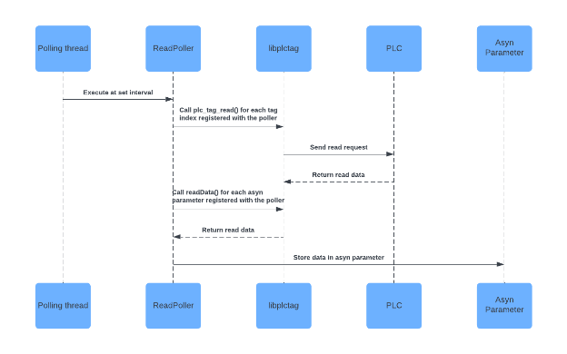

# <a name="_toc1825803900"></a>**Omroneip Software Manual v3 - release**
#
[Omroneip Software Manual v3 - release	1](#_toc1825803900)

[Definitions	1](#_toc1167569178)

[Introduction	2](#_toc1360026327)

[Installation guide	2](#_toc1237512826)

[IOC shell interface	3](#_toc1872414006)

[drvOmronEIPConfigure	3](#_toc1198336346)

[DrvOmronEIPConfigPoller	4](#_toc118884400)

[drvOmronEIPStructDefine	5](#_toc46036730)

[Debugging	6](#_toc1967192734)

[Record interface	6](#_toc247901984)

[drvInfo	6](#_toc2036067)

[Datatypes	8](#_toc1567493136)

[Supported behaviour matrix	10](#_toc1595089635)

[Reading UDT data efficiently (offsets and optimisations)	11](#_toc1681910069)

[Array optimisations	12](#_toc451730171)

[Offset and the structure definition file	13](#_toc676875934)

[Extras	14](#_toc1860123778)

[Example records	16](#_toc558233786)

[ReadFloat32 example	17](#_toc2042263546)

[ReadUDT example	17](#_toc1780812375)

[ReadArraySlice example	18](#_toc915451208)

[ReadBool example	18](#_toc1845333202)

[WriteString example	19](#_toc552867313)

[Autoreconnect	19](#_toc519672223)

[Performance testing	20](#_toc718920787)

[Appendix	20](#_toc386168155)

[Driver initialisation routine	21](#_toc1286753063)

[Poller behavior	22](#_toc1420001934)


## <a name="_toc1167569178"></a>**Definitions**
**Tag** - This word is used to refer to two similar but slightly different things which both share this name. A tag is both the name given to a CIP “variable” or “object” within the PLC and also the name used within **libplctag** to identify the structure used to communicate with the PLC tag. Where tags are mentioned, they will be specified as either **PLC** or **libplctag** tags.

**libplctag** - Is the name of the low level ethernet/IP library used to communicate with the PLC

**UDT/structure** - These two terms refer to the same thing. They refer to structured data within the PLC made of multiple standard datatypes as defined by the user within the PLC code.

**Field** - This is usually used to refer to an item within a **UDT/structure**, although it may also be used to refer to a field within an EPICS record

## <a name="_toc1360026327"></a>**Introduction**
[omroneip](https://github.com/Observatory-Sciences/omroneip) is an epics driver which communicates via the Ethernet/IP communications protocol. This driver is primarily intended to communicate with OmronNJ and NX series CPUs via Ethernet/IP, but there is no reason that it cannot be used to communicate with other Ethernet/IP devices, although this has not been tested. The driver relies upon an open source Ethernet/IP library called **libplctag** which supports many Alan-Bradley/Rockwell PLCs as well as OmronNJ/NX.

This manual describes how to use the omroneip driver and the meaning of the many different configuration options. It also goes into some detail about how important parts of the driver work.

Once you have had a look through this manual and built the driver, the next stop for newcomers should be to look in the **iocBoot/iocExample** folder within the driver. There is also a more comprehensive set of examples in **iocBoot/iocTest**. The startup cmd scripts call database files found in **omroneipApp/Db** and some come with .bob screens in **omroneipApp/opi**. In order for any of these startup scripts to successfully work you must configure your PLC with the relevant tags. For this reason it is best to start with **iocExample** as it only accesses a couple of tags.

If you do not have a PLC, there is also a very basic simulator which comes with libplctag called **ab\_server**. This can be used to create basic datatypes that can be read from this driver. The continuous integration tests in **iocBoot/iocCITests** make use of this simulator and may be of interest. If you create a fork of the [github repo](https://github.com/Observatory-Sciences/omroneip), you should be able to run these tests yourself.

## <a name="_toc1237512826"></a>**Installation guide**
This driver depends on epics base, the epics module [asyn](https://github.com/epics-modules/asyn) and the open source ethernet/IP library [libplctag](https://github.com/libplctag/libplctag)** to work. These should be downloaded and built separately to omroneip. It is recommended to use at least EPICS **base** **3.15.9**, **asyn** **R4-44-2** and **c++11**. For **libplctag**, version **v2.6.3** or later must be used, as this version implemented a number of fixes for OmronNJ/NX. Some of the unit tests also require c++17 to run.

To build omroneip, configure the locations of ASYN and EPICS\_BASE in the configure/RELEASE file or in RELEASE.local. You must also configure the location of LIBPLCTAG in configure/CONFIG\_SITE or CONFIG\_SITE.local.

You can then type make in the top level directory and assuming that you have valid versions of asyn, epics base, libplctag and g++, the driver should build successfully and be ready to use.
## <a name="_toc1872414006"></a>**IOC shell interface**
The driver has three available commands which can be called from the IOC. The first is used to create a new instance of the driver, the second is to create a readPoller to regularly read data from the driver and the third is used to input a structure definition file. It is expected that a user would typically create one instance of the driver for communicating with a single PLC. The user may create as many pollers as they like and give each one a different polling interval. Read records must be connected to one of these pollers in order to read data from the PLC. It is expected that the user would import a single structure definition file containing as many structure definitions as they require.

### <a name="_toc1198336346"></a>**drvOmronEIPConfigure**

```
drvOmronEIPConfigure(driverPortName, gateway, route\_path, plc, debug\_level, timezone\_offset)

drvOmronEIPConfigure("omronDriver", "10.2.2.57", "18,10.2.2.57","omron-njnx",0,0)
```

**driverPortName**: The name given to the driver object, this is referenced when creating pollers.

**gateway**: The ip address of the PLC gateway, the gateway may be the ethernet port of the PLC, or it may be different depending on your setup. For simple setups where you connect directly to the PLC’s ethernet port, use gateway=IP\_address and route\_path=18,IP\_address.

**route\_path**: The route\_path is used to path packets from the gateway to the ethernet/IP port you are communicating with. For help understanding this for Omron, see section 8-2-4 in the Omron NJ/NX ether/IP manual. Where the route path is defined as **Network\_type\_number\Destination\_address***.*

**plc**: This parameter is passed to libplctag, for the Omron NJ and NX PLC’s, use **plc=omron-njnx**. Other PLC’s supported by libplctag, but which may not be fully compatible with this driver are: plc5, slc500, logixpccc, micrologix800, micrologix, compactlogix

**debug\_level:** This parameter is passed to libplctag to set the verbosity of debug information that is printed to stdout. 0 = no debug information. 5 = max debug information. More information is available on the libplctag github wiki.

**timezone\_offset:** This is used when reading TIME variables from the PLC and outputting them as strings. As the PLC outputs all TIME datatypes in the PLCs local time, we must convert from this timezone to the timezone of the PC running the driver. We accept a double value (+/-) which gives the timezone of the PLC relative to GMT.


### <a name="_toc118884400"></a>**DrvOmronEIPConfigPoller**
#drvOmronEIPConfigPoller(driverPortName, pollerName, updateRate, spreadRequests)

```
drvOmronEIPConfigPoller("omronDriver", "fastPoller", 0.1, 0)

drvOmronEIPConfigPoller("omronDriver", "mediumPoller", 2, 0)

drvOmronEIPConfigPoller("omronDriver", "slowPoller", 10, 1)
```

**driverPortName**: The name given to the driver object

**pollerName**: The name given to the poller, this exact same name needs to be referenced on any record which should use this poller.

**updateRate**: The interval between reads in seconds. This interval is only a target and if many records are added to the poller, the PLC may not be able to service the requests in time to hit this target. 0.1 seconds is the fastest polling rate that I would recommend using, although up to 30Hz is theoretically possible when polling a single value. Note that if too much data is being requested, then the PLC will not be able to keep up and this updateRate may be missed. However the driver will read all data even if the updateRate is being missed, unless the timeout specified in the record expires, at which point the driver will skip to the next poll.

**spreadRequests**: This boolean toggles whether the poller spreads its read requests within its configured **updateRate**. If set to 0, we send all read requests configured with the poller to the PLC as fast as possible, every **updateRate** seconds. If set to 1, we evenly distribute the read requests throughout the first 80% of the configured timing interval. So if the **updateRate** was 10 seconds and there were 10 records sending read requests, the first request would be sent at 0 seconds, then 0.8 seconds, 1.6 seconds, etc. The interval between each request is still 10 seconds, but they are split up to stop causing congestion at the PLC end which could delay requests from other pollers. See the poller behaviour section of the appendix for more information.

### <a name="_toc46036730"></a>**drvOmronEIPStructDefine**

```
#drvOmronEIPStructDefine(driverPortName, pathToFile)
drvOmronEIPStructDefine("omronDriver", "../structFile.csv")
```

**driverPortName**: The name given to the driver object

**pathToFile**: The path to the structure definition file. All structure definitions for once instance of the driver should be included within a single file.

## <a name="_toc1967192734"></a>**Debugging**
Debugging is done through the asynTrace interface, this should be configured prior to iocInit() in order to capture logging during initialisation of the driver and database. Additional logging output from libplctag can be enabled by specifying a value for the **debug\_level** parameter passed to **drvOmronEIPConfigure**.

The asynTrace interface is used for outputting driver related errors, warnings, useful information and IO data. This can be enabled for your IOC by adding the following line to your IOC startup script or by writing them in the IOC shell:

asynSetTraceMask driverPortName 0x00FF

The mask 0x00FF enables logging of all message types, see <https://epics.anl.gov/modules/soft/asyn/R4-32/asynDriver.html> for the specifics of the masks.

## <a name="_toc247901984"></a>**Record interface**
Records which connect to the driver are configured in the same way as any other <https://epics-modules.github.io/master/asyn/R4-7/asynDriver.html>. Specifically, they require a DTYP which matches one of the asyn interfaces supported by the driver and a valid INP field:

```
field(DTYP,"asynXXX")
field(INP,"@asyn(portName,addr,timeout)drvInfo")
 `or
field(INP,"@asynMask(portName,addr,mask,timeout)drvInfo")
```

The **portName** should match the **portName** used when configuring the driver. The **addr** should always be 0. The asyn **timeout** is used to set the timeout for reading and writing data from/to the PLC. It defaults to 1 second. Note that if timeouts expire, then data will not be read and the driver will start the next poll. **asynMask** is used when accessing data through the asynUInt32Digital interface.

### <a name="_toc2036067"></a>**drvInfo**
For the driver to create a valid tag and connect it to the PLC, a valid drvInfo string must be supplied. This string must contain either 5 or 6, space separated values. Records which need to read information from the PLC must have 6 which includes the name of a linked poller, records which write information to the PLC must have 5 parameters and no poller named.

The drvInfo string for a read and a write record should look like:

```
@poller name[startIndex] datatype sliceSize offset extras 
 `and
name[startIndex] datatype sliceSize offset extras
```

**@poller**: This term specifies the name of a poller which is created with the drvOmronEIPConfigPoller command. The @ is required and is used to identify the following name as a poller. The record will be processed by the named poller.

**name[startIndex]**: This term can be quite complex as it is used to address tags in the PLC, this name can be used to address an entire tag, in which case only **name** is required. It can also be used to identify an item in an array. The integer **startIndex** identifies the item required from the array and starts at **1**. Tags which are structures can contain child datatypes, these are addressed as **name.child**. Even structures which contain child arrays can be accessed with **name[1].child[1].child**. Names may only contain A-Z a-z 0-9 – \_

**datatype**: This term identifies the type of data in the PLC which you wish to access and may differ from the datatype which the variable is stored as within EPICS. There are certain valid combinations of **datatype** and asynInterfaces defined from the **DTYP** field. A comprehensive list of these is found in the next section.

**sliceSize**: When the user wishes to access a slice of an array, they can do so by specifying an integer **sliceSize**. This must be used in combination with a name of type **name[startIndex]**.

**offset:** This is for more advanced use, especially where high performance reading is required, its effect depends on the datatype being requested and whether **&optimise=1** is set. If **&optimise=0** then this offset is used for byte offsetting within UDTs and STRINGs. If you wanted to read from the second character in a string for example, you can set offset = 1.

If **&optimise=1** then you are not offsetting into a single dtype, but instead you are offsetting to a position within a UDT. If you were optimising and knew that there was a REAL at position 12 within a structure, you could access this with offset = 1. Or as an alternative to offsetting with a byte integer value, you can instead import a structure definition file and then name a dtype within the structure. Such as structName[3]. The driver will then calculate the byte offset to the third dtype in the structure structName. More information is available on this further down.

**extras**: There are some extra variables which are used for using extra driver functionality. Some of these are passed to libplctag and used by it to deal with unusual data within the PLC. While others are used by this driver. The driver sets default values for these variables for use with OmronNJ PLCs. However if you have a specific use case where you may want to access a non standard string for example, extra variables can be added to the tag to deal with this. To use the **optimisation** functionality and to read/write strings, you should use **extras**. The **extras** input must be a list of string=value pairs, seperated by an **&**. A list of valid **extras** strings along with the default values and their meanings are shown further down.


## <a name="_toc1567493136"></a>**Datatypes**
The datatype part of drvInfo should match the type of datatype stored in the tag on the PLC. Any record which supports the the associated asyn interface can be used to read/write the specified Omron datatype.

|**Omron PLC datatype**|**Explanation**|**asyn interface**|
| :-: | :-: | :-: |
|Bool|0 or 1|asynUInt32Digital|
|SINT|8 bit signed int|asynInt32 / asynInt8Array|
|INT|16 bit signed int|asynInt32 / asynInt16Array|
|DINT|32 bit signed int|asynInt32 / asynInt32Array|
|LINT|64 bit signed int|asynInt64|
|USINT|8 bit unsigned int|asynInt32 / asynInt8Array|
|UINT|16 bit unsigned int|asynInt32 / asynInt16Array|
|UDINT|32 bit unsigned int|asynInt32 / asynInt32Array|
|ULINT|64 bit unsigned int|asynInt64|
|REAL|32 bit float|asynFloat64 / asynFloat32Array|
|LREAL|64 bit float|asynFloat64 / asynFloat32Array|
|TIME ( reads/writes TIME\_NSEC, DATE\_AND\_TIME\_NSEC, DATE\_NSEC, TIME\_OF\_DAY\_NSEC)|Stores time data in the PLC|asynInt64|
|String|Stores 1 to 255 characters|asynOctetRead|
|WORD|Used to address a 2 byte/char string|asynInt8ArrayIn|
|DWORD|Used to address a 4 byte/char string|asynInt8ArrayIn|
|LWORD|Used to address a 8 byte/char string|asynInt8ArrayIn|
|User Defined Type (UDT)|A tag which stores a collection of other datatypes|asynInt8ArrayIn|
|Any other dtype|Any data accessible via ethernet/IP can be downloaded as a byte array by specifying the datatype as UDT.|AsynInt8ArrayIn|
##

## <a name="_toc1595089635"></a>**Supported behaviour matrix**
Each datatype can be read and written to with the same combination of asyn interface and record type. To read/write arrays of a datatype, the correct asynXXXArray interface must be used, only the datatypes which use the asynXXXArray interface can be read as arrays. (With the exception of a bool array which can be read into a UInt32Digital and then output to any record which supports this interface)

The table does **not** show every record type which supports the asynInterface, just some of the most common use cases. If a record supports an asyn interface, then it should support read/writing any datatype which is read/written to through that interface.

|**asyn interface**|**ai/ao**|**longin/longout**|**bi/bo/mbbiDirect**|**stringin/stringout/ lsi/lso**|**waveform**|
| :-: | :-: | :-: | :-: | :-: | :-: |
|asynInt32|SINT,INT,DINT,USINT,UINT,UDINT|SINT,INT,DINT,USINT,UINT,UDINT||||
|asynInt64|LINT, ULINT|||||
|asynUInt32Digital|||BOOL|||
|asynFloat64|REAL,LREAL|||||
|asynOctet||||STRING||
|asynInt8Array|||||WORD,DWORD,LWORD,UDT, SINT, USINT (+any other data type)\*|
|asynInt16Array|||||INT, UINT|
|asynInt32Array|||||DINT, UDINT|
|asynFloat32Array|||||REAL|
|asynFloat64Array|||||LREAL|

\*Any data accessible on the PLC should be readable into a waveform record through the asynInt8Array using the UDT datatype. The data will be read into the waveform as a raw array of bytes. It is perfectly OK to read an INT using the asynInt8Array interface, but the type UDT must be specified and not INT.

\*Arrays of strings cannot currently be fetched as a whole array or a slice, they must be fetched individually. I think this is a problem with the PLC?

## <a name="_toc1681910069"></a>**Reading UDT data efficiently (offsets and optimisations)**
The recommended way of reading large amounts of data efficiently is to either read in whole arrays or slices of arrays of standard datatypes, so that the size of the slice makes the most use of the maximum CIP data packet size. However, some use cases structure groups of mixed datatype data inside **UDTs**. In this case, the most efficient way to read this data is to use **optimisations**. These are more complicated to setup but can offer the same performance as downloading the data in arrays and are a lot more efficient than reading each item in the **UDT** individually.

Performance is usually limited by the speed in which the PLC can respond to read requests and so for the best performance we want to read as much data in a single read request as possible. The ideal structure of data within the PLC would therefor by either a single **UDT** of 1994 bytes or an array of **UDTs** where a certain slice of **UDTs** adds up to as close to 1994 bytes as possible. With 1994 bytes being the maximum data payload within a single CIP message when communicating with Omron NJ/NX PLCs. For other PLC types the maximum payload size varies and so the most efficient structure size will depend on the PLC you are communicating with.

If you set **&optimise=1** and then request multiple members of a UDT, instead of requesting each member individually, the driver requests the entire structure, caches this data, and selects the requested members to be read out to the user. This **optimisation** process can dramatically improve performance in specific cases. For example, if the user wished to get 5 different members of a structure, instead of sending 5 CIP requests to the PLC, the driver could send one request to get the entire structure and then split up the structure locally. See **iocBoot/iocTest/efficientVsInefficientTest.cmd** for an example of this. **When optimising you need to set the name part of the drvInfo string to the name of the UDT which contains the field you want to read, the offset is then used to get the data from the field.**

As the driver knows nothing about the internals of the structure/UDT, the user must specify an **offset**; either an integer **offset** or a reference to a struct within an imported structure definition file. This allows the records to find the relevant data within the UDT. If you request that a tag is optimised, then when the asyn parameter is first created, no libplctag tag is made. Instead we load all records, create the asynParameters and then we attempt to optimise. If this is successful we will make the tags at this point, otherwise we will report an error and no tags will be made. See the driver initialisation section of the appendix for more information on how optimisations are done.


### <a name="_toc451730171"></a>**Array optimisations**
If you are trying to read fields from a UDT within an array and have requested **&optimise=1**,** there will be an additional array optimisation. The driver will look to see if you are reading multiple UDTs from the same array, if you are then it will try and download slices of the array if possible.

For example, if you had an array of 136 UDTs, each of size 232 bytes and you wanted to read two fields from each UDT, you would create 280 records, 2 for each UDT. You would specify the name in the drvInfo as the array element, such as arrayName[1], then specify the offset to the data within the UDT and specify **&optimise=1**. The driver will detect that this situation can be optimised and instead of requesting 136 elements, it will request 17 slices of 8 arrays and it will automatically offset to the correct UDT within the slice when reading the data into EPICS. **Note that when reading an array of arrays or an array of UDTs with optimisations, the sliceSize is not used to slice up the top level array. It is used to get a slice of an array within the top array, or a slice of an array within the UDTs within the top array.** Therefor you should specify individual elements within an array of UDTs and not a slice of UDTs when optimising arrays. You can still slice if reading the data raw into a waveform without optimisations. See **iocBoot/iocTest/arrayOptimisationsTest.cmd** for an example of array optimisations.

## <a name="_toc676875934"></a>**Offset and the structure definition file**
When setting an **offset**, you can either set it equal to “none”, a byte offset, or the user can specify a member from a structure defined in the structure definition file. With the byte offset, the driver would simply look up the locally cached UDT and read the specified datatype from the offset index. The structure definition file method works the same way, in that an offset is used to read the data from a cached UDT, however the offset index is automatically calculated by the driver at initialisation based off the definition file.

The structure definition file should contain comma separated lists with a new list on each line. The first item in each list should be the name used to identify the structure, this name is then referenced in the INP field of a record. The other items in the list should either be valid datatypes from the datatype table above, the name of another structure in this file or an array of one of these. For example:

```
myStruct,REAL,STRING[30],INT,INT,UINT
anotherStruct,LREAL,LINT,STRING[10]
nestedStruct,myStruct,INT
arrayStruct,INT,"ARRAY[1..10] OF myStruct",BOOL,BOOL
```

If a user requested to read an INT from within the UDT from the PLC and specified the drvInfo string:

```
@poller myUDT INT 1 nestedStruct[6] &optimise=1
```

Assuming the optimisation works (at least two reads from the same struct are needed), the driver would first read myUDT from the PLC. Then it would calculate the integer byte offset of the sixth member of the nestedStruct UDT. It would then use this offset to return an INT from that location within the UDT.

If there are other records which also need data from this UDT, and the user enables optimisations, these records will offset into the same downloaded data rather than sending a read request to the PLC. See **omroneipApp/Db/testGoodOptimisation.db**, **iocBoot/iocTest/testStructDefs.csv** and **iocBoot/iocTest/goodOptimisationTests.cmd** for some examples.

When writing data, the offset can still be used to write to some byte offset within a datatype, for example if you want to overwrite part of a string for some reason. However, there is no optimisation done when writing to UDTs. All write requests to UDT members are done directly with single writes rather than updating an internal UDT and later writing that.


## <a name="_toc1860123778"></a>**Extras**
This section highlights a few of these attributes which are relevant for communicating with Omron NJ PLCs. However all are available to users of the driver. This driver redefines some of these attributes from the defaults used in libplctag. If you dont want to use a default value, you will need to specifically overwrite it with a new value for that attribute. The driver also defines some attributes which are not used by libplctag. For more information on the tag attributes used by libplctag : <https://github.com/libplctag/libplctag/wiki/Tag-String-Attributes>.

|**Attribute**|**Driver default value**|**libplctag or omroneip**|**Function**|
| :-: | :-: | :-: | :-: |
|allow\_packing|1|libplctag|Allows multiple read requests to be bundled into a single CIP message. This greatly improves performance but can cause problems for certain data types.|
|str\_is\_zero\_terminated|0|libplctag|Individually addressed strings are not zero terminated, but strings embedded in structs/arrays are when the entire struct/array is read as a single tag.|
|str\_is\_fixed\_length|0|libplctag|Individually addressed strings are the size of the data written in them, not their max size. Strings embedded in structs/arrays contain the entirety of the string, even if some of it null data.|
|str\_is\_counted|1|libplctag|Individually addressed strings are counted, but strings embedded in structs/arrays are not when the entire struct/array is read as a single tag.|
|str\_count\_word\_bytes|2|libplctag|Always true but only if the string is counted|
|str\_pad\_to\_multiple\_bytes|0|libplctag|String data is never padded.|
|str\_max\_capacity|undefined|both|This **must** be set by the user when attempting to read individual strings or individual strings inside arrays/struct. It should be set to the max size of the string, not the number of useful chars in the string.|
|optimise|0|omroneip|If enabled, the driver attempts to optimise this tag as explained in this manual.|
|offset\_read\_size|undefined|omroneip|This should be used in combination with an offset value and **optimise=0** to read a custom number of bytes from a UDT/string. If you wanted to read 10 byes at offset 5, you should set offset\_read\_size=10 and offset = 5. This cannot be used while optimising.|
|read\_as\_string|0|omroneip|This is currently just used to display a TIME variable as a nicely formatted string (in local time), rather than as an Int64 as is the default behaviour. See the **testTime.db** file for an example.|


## <a name="_toc558233786"></a>**Example records**
This section explains a few different examples. A full list of example records comes with the driver in the form of .db or .template files. I strongly recommend checking out these db file as well as the cmd files which load the databases and call the relevant omroneip commands.

Record fields required for driver operation (either @asyn or @asynMask should be used):

```
field(DTYP, "asynXXX")
field(INP, "@asyn(portName,addr,timeout)@poller name[startIndex] datatype sliceSize offset extras")
field(INP, "@asynMask(portName,addr,mask,timeout)@poller name[startIndex] datatype sliceSize offset extras")
```

### <a name="_toc2042263546"></a>**ReadFloat32 example**
###

```
record(ai, "$(P)readFloat32") {
`    `field(SCAN, "I/O Intr")
`    `field(DTYP, "asynFloat64")
`    `field(INP, "@asyn(myPort, 0, 0.5)@myPoller testArray[1].PVValue REAL 1 none none")
}
```

This record is connected to myPoller with a 0.5s timeout. It reads from element 1 of the array, testArray. This is an array of structs, these structs have a member called PVValue which is a REAL datatype. This record will be updated every time the poller processes. The sliceSize must be 1 as we are accessing a single datatype (PVValue).

### <a name="_toc1780812375"></a>**ReadUDT example**
###

```
record(waveform, "$(P)readUDT") {
`    `field(SCAN, "I/O Intr")
`    `field(FTVL, "UCHAR")
`    `field(DTYP, "asynInt8ArrayIn")
`    `field(INP, "@asyn(myPort, 0, 1)@myPoller testArray[1] UDT 1 none none")
`    `field(NELM, "1996")
}
```

This record reads a UDT/structure from the PLC. The structure is stored at element 1 of the array. The asynInt8ArrayIn interface is used and the data is stored as an array of bytes within the waveform record.

### <a name="_toc915451208"></a>**ReadArraySlice example**
###

```
record(waveform, "$(P)readArraySlice") {
`    `field(SCAN, "I/O Intr")
`    `field(FTVL, "UCHAR")
`    `field(DTYP, "asynInt8ArrayIn")
`    `field(INP, "@asyn($(PORT), 0, 1)@$(POLLER) testArray[3] UDT 3 none none")
`    `field(NELM, "1996")
}
```

This record reads a slice of three elements of an array, starting at element 3. Each element of the array is a UDT and asynInt8ArrayIn is used in combination with the UDT datatype. All three elements will be read into the waveform.

### <a name="_toc1845333202"></a>**ReadBool example**
###

```
record(bi, "$(P)readBool") {
`    `field(SCAN, "I/O Intr")
`    `field(DTYP, "asynUInt32Digital")
`    `field(INP, "@asynMask(myPort, 0, 0x0001, 1)@myPoller testBOOL BOOL 1 none none")
`    `field(ZNAM, "Off")
`    `field(ONAM, "On")
}
```

This bi record reads in a boolean value from the PLC for which it must use the asynUInt32Digital interface.

The mask part of the asynMask call can be used to only get certain bits from within the UINT32Digital. So you could read an array of 32 bits into an asynUInt32Digital parameter and have 32 records each with a different asynMask. Each record would share a single libplctag tag and therefor datasource, but they would each have a different asynParameter and would read different bits. The asyn mask is used here rather than the offset parameter, as this allows the offset parameter to be used to offset into a UDT which contains an array of bools at a certain offset.

### <a name="_toc552867313"></a>**WriteString example**
###

```
record(lso, "$(P)writeString") {
`    `field(DTYP, "asynOctetWrite")
`    `field(OUT, "@asyn(myPort, 0, 1)testString STRING 1 none &str\_max\_capacity=60")
`    `field(SIZV, "61")
}
```

This record writes to a STRING[60]. SIZV should be 61 chars as in this case the PLC does not return a null byte terminated string, so room is required for this. Whenever the user specifies a STRING, the str\_max\_capacity must be set to the size of the string in the PLC. No readPoller is specified as this record writes to the PLC

## <a name="_toc519672223"></a>**Autoreconnect**
If a tag on the PLC is not available at IOC startup, the tag will not automatically connect if it later becomes available. However if the tag is successfully created and later disconnects, it should automatically reconnect on the next read of the readPoller, if the cause of the disconnect is fixed.

## <a name="_toc718920787"></a>**Performance testing**
Performance is limited by the time the PLC takes to respond to read requests and the network travel time of the read/write requests. The PLC can only accept one read/write request at the time, and so libplctag waits for each read/write request to return or timeout before sending the next request. This is the main limiter of performance and means that sending as much data in each packet as possible is essential for good performance. I have anecdotally seen the driver running ~50% CPU usage while under maximum load.

Tests of reading single, individual tags as fast as possible has given average speeds of approximately 90 reads per second, but this of course depends on your network conditions.

A real world test was done which used optimisations to download an array of 140 UDTs, each UDT was 226 bytes large. In this test, a total of 5180 records were created, each with its own asyn parameter. Most of these parameters read datatypes from within the UDTs, although some records also wrote to other PLC tags. The driver created a total of 721 libplctags.

Of these 721 tags, only 21 were reading data from the driver, the other 700 were writing. The 21 read tags were automatically created using optimisations. The driver split the 140 UDTs into 17 slices of 8 UDTs to give 136, and the final 4 UDTs were read directly rather than as slices of the array., giving a total of 21 libplctag tags. Each slice of 8 UDTs, was 1808 bytes large, fairly close to the 1994 byte max size. Using this setup it took on average of 220ms to download all 140 UDTs, totalling 31,640 bytes. This gives a download rate of approximately 144KB/s. The performance could be further increased by fully maxing out the 1994 limit for every read, but this result seems like a fairly realistic maximum performance when trying to optimise a real life situation.


## <a name="_toc386168155"></a>**Appendix**
### <a name="_toc1286753063"></a>**Driver initialisation routine**
- Setup the driver with a call to:
  - drvOmronEIPConfigure(driverPortName, gateway, route\_path, plc, debug\_level, timezone\_offset)
- Configure and setup an arbitrary number of read pollers with:
  - drvOmronEIPConfigPoller(driverPortName, pollerName, updateRate, spreadReq
- Optionally load in a struct definitions file with:
  - drvOmronEIPStructDefine(driverPortName, pathToFile)
- Load database files and then call iocInit()
  - Any records which create an asyn parameter will call drvUserCreate twice. For each such record which does **not** specify **&optimise=1** the following will happen:
    - Check to see if this drvInfo already has a valid asyn parameter, if it does then we just update the reason of this asynUser to the index of the existing parameter and return. Otherwise…
    - Parse drvInfo to get the useful data
    - Create a libplctag tag with a unique **tag index**.
    - Create a newDrvUser which is a structure that tracks all of the useful information connected to the asyn parameter
    - Create the asyn parameter, basing the parameter type on the datatype passed in drvInfo. Each asyn parameter has a unique **asyn index**
    - Add the new asyn parameter and the newDrvUser to a map which tracks all of the parameters, with the **asyn index** as the key. This map is called *tagMap\_*
    - Read the data for the tag, this is done for both read and write parameters.
    - Set the asyn user's reason to the **asyn index** which was created.
  - For records which **do** specify **&optimise=1**:
    - The same process occurs, but instead of creating the libplctag tag and reading it in *drvUserCreate()*, the tag is created later, in the *optimiseTags()* function, but only if the optimisation succeeds. For optimisation tags, the PLC tag is read when the tag is created, but the records are not updated initially, only by the poller when this starts.
  - After iocInit() has finished, the previously mentioned *optimiseTags()* function is called by a hook linked to the running of the IOC. This is the hook state: *initHookAfterIocRunning* 
  - The *optimiseTags()* function attempts to optimise any tags which have requested this, part of this process is the creation of libplctag tags. At least two records must specify data from the same UDT/structure for an optimisation to succeed. A single tag is created to read an entire UDT, or slice of UDTs, each asyn parameter which needs data from the UDT(s), will be linked to this single tag. Only one of the asyn parameters will actually send a read request to the PLC, but they will all read data from the same downloaded UDT(s). The **tag indexes** in tagMap\_ are updated with these newly created **tag indexes** for their linked **asyn indexes**.
  - *optimiseTags()* then sets the *startPollers\_* flag equal to true. This tells any configured pollers to start polling. At this point all asyn parameters and libplctag tags should have been created, and the driver is now fully initialised.

### <a name="_toc1420001934"></a>**Poller behavior**
- An arbitrary number of read pollers can be created from the IOC shell.
- Each poller runs in its own thread and is independent from the other pollers
- Pollers start after the *optimiseTags()* function finishes which is after iocInit
- The readPoller() is the main polling function, this does two distinct things:
  - Send read requests to libplctag with the plc\_tag\_read() api call which then sends read requests to the PLC.
  - Read data from within libplctag which has already been fetched by the previous api call.

The following code is responsible for sending read requests to the PLC:

```cpp
for (auto x : tagMap\_)
`    `{
`      `if (x.second->pollerName == threadName && x.second->readFlag == true)
`      `{
`        `asynPrint(pasynUserSelf, ASYN\_TRACE\_FLOW, "%s:%s Reading tag: %d with polling interval: %f seconds\n", driverName, functionName, x.second->tagIndex, interval);
`        `plc\_tag\_read(x.second->tagIndex, 0); // read from plc, we will check status and timeouts later
`        `// We sleep to split up read requests within timing interval, otherwise we can get traffic jams and missed polling intervals
`        `if (pPoller->myTagCount\_ > 1 && pPoller->spreadRequests\_)
`        `{
`          `pollingDelay = (interval - 0.2 \* interval) / pPoller->myTagCount\_;
`          `epicsThreadSleep(pollingDelay);
`        `}
`      `}
`    `}
```

The code above does the following for each **tag index** which is registered with this poller and configured to read (during optimisation, asyn parameters which share a **tag index** are all set to not read except for one “master” parameter):

- Send a read request to libplctag of that **tag index** with no timeout.
- If the user has requested not to spread out the read requests throughout the polling interval, then we just send out these read requests as quickly as possible. This setup will give the best performance.
- If the user has requested to spread out the read requests, then we wait a short while before sending the next read request. The time we wait is calculated by dividing 80% of the polling interval by the number of tags which this poller read reads.

libplctag manages the connection to the plc, it will immediately send an ethernet/IP message to the PLC and will set the tags status to *PLCTAG\_STATUS\_PENDING* until a response has been received.

Once all of the read requests have been sent, the following code is executed:

```cpp
`    `for (auto x : tagMap\_)
`    `{
`      `if (x.second->pollerName == threadName)
`      `{
`        `readData(x.second, x.first);
`      `}
`    `}
```

The code above calls the *readData()* function which uses data configured in the asyn parameters tag to work out how to read the data read from the PLC. We call this for each **asyn index** and pass both the **asyn index** (x.first) and the **drvUser** (x.second).

Within the *readData()* function is the following code:

```cpp
` `while (still\_pending)
`  `{
`    `status = plc\_tag\_status(drvUser->tagIndex);
`    `// It should be rare that data for the first tag has not arrived before the last tag is read
`    `// Therefore this if statement will normally be skipped, or called once by the first few tags as we
`    `// are asynchronously waiting for all tags in this poller to be read.
`    `if (status == PLCTAG\_STATUS\_PENDING)
`    `{
`      `epicsThreadSleep(0.01);
`      `timeoutTimeTaken = (std::chrono::duration\_cast<std::chrono::milliseconds>(std::chrono::system\_clock::now() - timeoutStartTime).count()) \* 0.001; // seconds
`      `// We wait so that we dont spam libplctag with status requests which can cause 100ms freezes
`      `if (timeoutTimeTaken >= drvUser->timeout)
`      `{
`        `// If the timeout specified in the records INP/OUT field is hit, we set the status to asynTimeout
`        `// To be precise, this is the timeout to enter this loop is the time between the last read request for this poller being sent and the current time,
`        `// this means that the first read requests will have slightly longer than their timeout period for their data to return.
`        `setParamStatus(asynIndex, asynTimeout);
`        `setParamAlarmStatus(asynIndex, asynTimeout);
`        `setParamAlarmSeverity(asynIndex, MAJOR\_ALARM);
`        `readFailed = true;
`        `asynPrint(pasynUserSelf, ASYN\_TRACE\_WARNING, "%s:%s Warn, Timeout finishing read tag %d: %s. Decrease the polling rate or increase the timeout.\n",
`                  `driverName, functionName, drvUser->tagIndex, plc\_tag\_decode\_error(status));
`        `still\_pending = 0;
`      `}
`    `}

`    `else if (status < 0)
`    `{
`      `setParamStatus(asynIndex, asynError);
`      `setParamAlarmStatus(asynIndex, asynError);
`      `setParamAlarmSeverity(asynIndex, MAJOR\_ALARM);
`      `readFailed = true;
`      `asynPrint(pasynUserSelf, ASYN\_TRACE\_ERROR, "%s:%s Err, finishing read of tag %d: %s\n",
`                `driverName, functionName, drvUser->tagIndex, plc\_tag\_decode\_error(status));
`      `still\_pending = 0;
`    `}

`    `else
`    `{
`      `still\_pending = 0;
`    `}
`  `}
```

*still\_pending* starts true, so we do an initial check of the status of the **tag index** to see if our read request has finished.

If status == PLCTAG\_STATUS\_PENDING* then we check the time since the read request was sent to see if the asyn timeout time has been reached. If the timeout has been reached then we exit this function, set some alarms and abort the reading of data from the library. We also do a 0.01 second wait here, this is to avoid sending plc\_tag\_status calls too quickly which can freeze up the library.

If the status < 0, then there has been an error reading the data, we exit and set alarms

else, the status must be good, so we quit this while loop and continue to read the data from libplctag.

When reading data from tags in libplctag (done in the *readData()* function), we lock the tag so that the tags data doesn't change while we are reading it.

Simplified sequencing diagram showing the read pollers behaviour. readData() calls one of many different plc\_tag\_get…() functions which get data cached in libplctag and send it to any records which use the asyn parameter which requested the readData().
